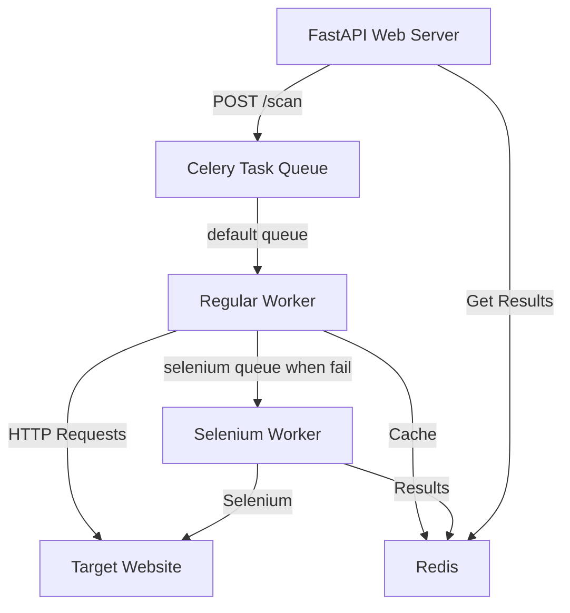

# 🔍 Broken Link Checker

A powerful and efficient web crawler that checks for broken links on websites using a multi-queue system with Selenium support for JavaScript-heavy pages.

## 🌟 Features

- 🔄 Asynchronous crawling with parallel requests
- 🎯 Separate queues for regular and Selenium-based checks
- 💾 Redis caching for external links
- 🦊 Firefox-based Selenium for JavaScript-heavy pages
- 📊 Detailed link status reporting
- 🔒 SSL support for Redis connections
- 🚀 Scalable architecture with Docker

## 🏗️ Architecture

### System Components



### Queue System

1. **Default Queue** 🚀

   - Handles regular HTTP requests
   - Processes internal links
   - Manages external link checks
   - Uses async/await for efficiency

2. **Selenium Queue** 🦊
   - Dedicated worker for JavaScript-heavy pages
   - Single Firefox instance for resource efficiency
   - Handles failed HEAD/GET requests
   - Processes dynamic content

### Caching System

- External links cached for 1 hour
- Redis-based storage
- Prevents redundant checks

## 🛠️ Setup

### Prerequisites

- Docker and Docker Compose
- Python 3.11+
- Redis (included in Docker setup)

### Environment Variables

Create a `.env` file with:

```env
REDIS_URL=redis://redis:6379/0
CORS_ORIGINS=["*"]
PORT=8000
```

### Building and Running

1. Clone the repository

2. Build and start the services:

```bash
docker-compose up -d --build
```

3. Access the API:

```bash
curl -X POST http://localhost:8000/scan -H "Content-Type: application/json" -d '{"url": "https://example.com"}'
```

## 🔄 How It Works

1. **Initial Request** 📥

   - User submits URL to scan
   - FastAPI creates task ID
   - Celery enqueues crawling task

2. **Crawling Process** 🕷️

   - Regular worker processes URLs
   - HEAD requests first
   - GET requests if HEAD fails
   - Selenium for JavaScript-heavy pages

3. **Link Processing** 🔗

   - Internal links: Full crawl
   - External links: Check and cache
   - JavaScript links: Selenium queue

4. **Result Storage** 💾
   - Redis stores all results
   - Caches external links
   - Maintains task status

## 📊 API Endpoints

### POST /scan

Start a new website scan.

```json
{
	"url": "https://example.com"
}
```

### GET /results/{task_id}

Get scan results.

```json
{
	"task_id": "123",
	"status": "SUCCESS",
	"results": [
		{
			"url": "https://example.com",
			"status": 200,
			"type": "internal",
			"parent": null,
			"details": "Checked with HEAD"
		}
	]
}
```

More at /doc

## 🚀 Performance Considerations

- Parallel processing of URLs
- Efficient caching system
- Single Selenium instance
- Resource limits per worker
- Connection pooling
- Timeout handling

## 🔧 Troubleshooting

1. **Redis Connection Issues**

   - Check Redis URL in .env
   - Verify Redis container is running
   - Check network connectivity

2. **Selenium Problems**

   - Verify Firefox installation
   - Check shared memory settings
   - Monitor worker logs

3. **Task Processing**
   - Check worker logs
   - Verify queue configuration
   - Monitor Redis for results